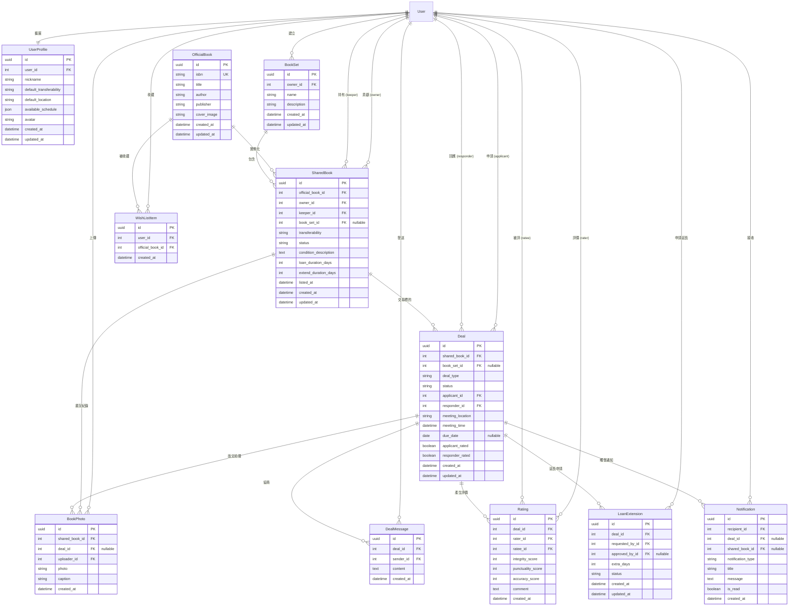
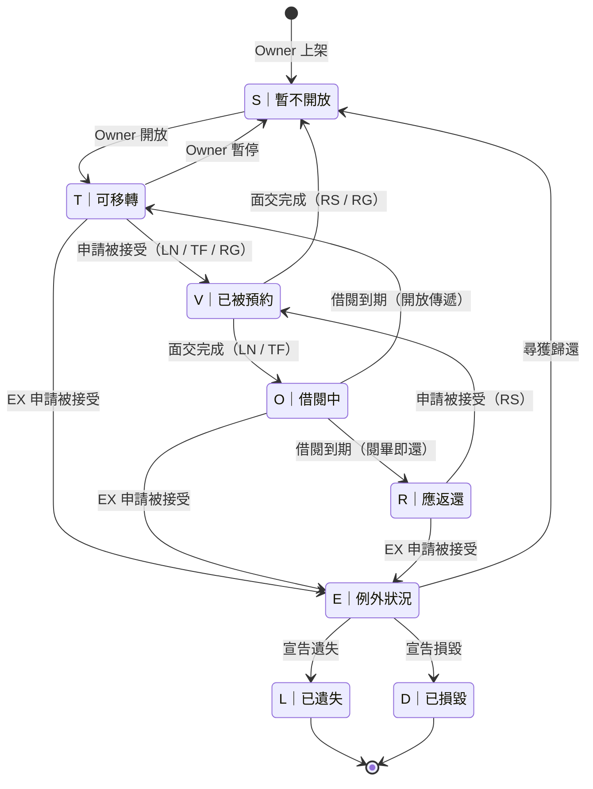

# Exbooks 共享書籍 — 系統分析

> **版本**: v1.1.0 @2026-03-06
> **類型**: 系統分析文件 (System Analysis Document)
> **角色**: 系統架構師 / 系統分析師

---

## 目錄

1. [實體識別與分析](#1-實體識別與分析)
2. [ER Diagram 實體關係圖](#2-er-diagram-實體關係圖)
3. [Database Schema 規劃](#3-database-schema-規劃)
4. [設計決策記錄](#5-設計決策記錄)

---

## 1. 實體識別與分析

### 1.1 實體清單

| #   | 實體     | 英文          | 說明                                           | 來源           |
| --- | -------- | ------------- | ---------------------------------------------- | -------------- |
| 1   | 用戶資料 | UserProfile   | 擴展 Django User，存放暱稱、偏好設定等         | 3.2 使用者註冊 |
| 2   | 官方書籍 | OfficialBook  | 以 ISBN 為鍵的書籍元資料（書名、作者、出版社） | 3.2 書籍上架   |
| 3   | 分享書籍 | SharedBook    | 用戶貢獻的特定書冊（書況、流通性、狀態）       | 3.2 書籍上架   |
| 4   | 套書     | BookSet       | 書籍套組，綁定後限制整套借出                   | 規則 #7        |
| 5   | 交易     | Deal          | 借用/傳遞/返還/回歸/例外等交易記錄             | 5.2 交易類別   |
| 6   | 交易留言 | DealMessage   | 交易雙方的協商訊息                             | UC: Negotiate  |
| 7   | 書況照片 | BookPhoto     | 書籍現況照片紀錄                               | 3.2 書況確認   |
| 8   | 評價     | Rating        | 交易後雙方互評紀錄                             | 4.3 信用與評價 |
| 9   | 願望書車 | WishListItem  | 讀者的書籍願望清單                             | UC: WishList   |
| 10  | 延長申請 | LoanExtension | 借閱延長申請與核准                             | UC: ExtendLoan |
| 11  | 通知     | Notification  | 系統通知（到期提醒、交易通知等）               | UC: MailNotice |

### 1.2 角色模型分析

用例圖定義了以下角色繼承關係：

```
NonMember（非會員）
Member（會員）
  ├── Reader（讀者）    — 情境角色：想借閱書籍的用戶
  ├── Keeper（持有者）  — 情境角色：當前持有書籍的用戶
  └── Owner（貢獻者）   — 情境角色：貢獻書籍的用戶
SysAdmin（管理員）
Timer（系統計時器）      — 非人類角色，定時任務觸發器
```

> **關鍵設計決策**：Owner / Keeper / Reader **不是** 固定的用戶類型，而是相對於特定 `SharedBook` 的情境角色。
> 同一用戶可能同時是某書的 Owner、另一書的 Keeper、又是第三本書的 Reader。
> 因此，角色不存為用戶屬性，而是透過 `SharedBook.owner`、`SharedBook.keeper`、`Deal.applicant` 等外鍵關係隱含表達。

---

## 2. ER Diagram 實體關係圖



---

## 3. Database Schema 規劃

### 3.1 列舉值定義

#### 書籍流通性 (Transferability)

| 值         | 說明                                    |
| ---------- | --------------------------------------- |
| `TRANSFER` | 開放傳遞 — 借閱到期後繼續保管，可再傳遞 |
| `RETURN`   | 閱畢即還 — 借閱到期後須歸還給 Owner     |

#### 書籍狀態 (Book Status)

| 代碼 | 常數名稱     | 說明     | 可觸發的交易類別      |
| ---- | ------------ | -------- | --------------------- |
| `S`  | SUSPENDED    | 暫不開放 | 無（Owner 手動管理）  |
| `T`  | TRANSFERABLE | 可移轉   | TF (Transfer)         |
| `R`  | RESTORABLE   | 應返還   | RS (Restore)          |
| `V`  | RESERVED     | 已被預約 | 無（等待面交中）      |
| `O`  | OCCUPIED     | 借閱中   | EX (Except)、延長申請 |
| `E`  | EXCEPTION    | 例外狀況 | EX (Except)           |
| `L`  | LOST         | 已遺失   | 無（終態）            |
| `D`  | DESTROYED    | 已損毀   | 無（終態）            |

#### 書籍狀態轉移圖



#### 交易類別 (Deal Type)

| 代碼 | 常數名稱 | 流通性條件 | 申請者角色      | 回應者角色 | 面交地點決定者 |
| ---- | -------- | ---------- | --------------- | ---------- | -------------- |
| `LN` | LOAN     | 閱畢即還   | Reader          | Owner      | Owner          |
| `RS` | RESTORE  | 閱畢即還   | Keeper (Reader) | Owner      | Owner          |
| `TF` | TRANSFER | 開放傳遞   | Reader          | Keeper     | Keeper         |
| `RG` | REGRESS  | 開放傳遞   | Owner           | Keeper     | Keeper         |
| `EX` | EXCEPT   | 任意       | Keeper          | Owner      | 雙方協議       |

#### 交易狀態 (Deal Status)

| 代碼 | 常數名稱  | 說明                   | 後續動作          |
| ---- | --------- | ---------------------- | ----------------- |
| `Q`  | REQUESTED | 已請求，待回應         | 回應者可接受/拒絕 |
| `P`  | RESPONDED | 已回應（同意），待面交 | 雙方約定面交      |
| `M`  | MEETED    | 已面交，待評價         | 雙方互評          |
| `D`  | DONE      | 已完成                 | 終態              |
| `X`  | CANCELLED | 已取消/拒絕            | 終態              |

#### 延長申請狀態 (Extension Status)

| 值         | 說明   |
| ---------- | ------ |
| `PENDING`  | 待審核 |
| `APPROVED` | 已核准 |
| `REJECTED` | 已拒絕 |

#### 通知類型 (Notification Type)

| 值                 | 說明                     |
| ------------------ | ------------------------ |
| `DEAL_REQUESTED`   | 收到交易申請             |
| `DEAL_RESPONDED`   | 交易已被回應             |
| `DEAL_CANCELLED`   | 交易被取消/拒絕          |
| `DEAL_MEETED`      | 面交完成，請評價         |
| `BOOK_DUE_SOON`    | 書籍即將到期（提前通知） |
| `BOOK_OVERDUE`     | 書籍已逾期               |
| `BOOK_AVAILABLE`   | 願望書車中的書籍已可借閱 |
| `EXTEND_REQUESTED` | 收到延長申請             |
| `EXTEND_APPROVED`  | 延長申請已核准           |
| `EXTEND_REJECTED`  | 延長申請已拒絕           |

#### 評價評分 (Rating Score)

- 評分範圍：**1 ~ 5**（1 = 極差，5 = 極佳）
- 評分維度：
  - `integrity_score` — 誠信
  - `punctuality_score` — 準時
  - `accuracy_score` — 書況描述準確度

### 3.2 約束與索引策略

#### 唯一性約束 (Unique Constraints)

| 實體         | 約束欄位                | 說明                         |
| ------------ | ----------------------- | ---------------------------- |
| OfficialBook | `isbn`                  | ISBN 全域唯一                |
| Rating       | `(deal, rater)`         | 同一交易中，每人只能評價一次 |
| WishListItem | `(user, official_book)` | 同一書籍只能收藏一次         |

#### 索引策略 (Indexes)

| 實體         | 索引欄位                | 類型      | 理由                   |
| ------------ | ----------------------- | --------- | ---------------------- |
| OfficialBook | `title`                 | B-Tree    | 書名搜尋               |
| OfficialBook | `author`                | B-Tree    | 作者搜尋               |
| SharedBook   | `status`                | B-Tree    | 按狀態篩選（高頻查詢） |
| SharedBook   | `(owner, status)`       | Composite | Owner 查看自己的書籍   |
| SharedBook   | `(keeper, status)`      | Composite | Keeper 查看持有的書籍  |
| Deal         | `(applicant, status)`   | Composite | 用戶查看自己的申請     |
| Deal         | `(responder, status)`   | Composite | 用戶查看待回應的交易   |
| Deal         | `(shared_book, status)` | Composite | 查看書籍的交易紀錄     |
| Deal         | `due_date`              | B-Tree    | 定時任務查詢到期交易   |
| Notification | `(recipient, is_read)`  | Composite | 用戶查看未讀通知       |

### 3.3 業務規則約束

| #     | 規則                                                               | 實現層級                |
| ----- | ------------------------------------------------------------------ | ----------------------- |
| BR-1  | 借閱天數：最少 15 天、最多 90 天、預設 30 天                       | Model Validation        |
| BR-2  | 延長天數：最少 7 天、最多 30 天                                    | Model Validation        |
| BR-3  | LN/RS 交易僅適用於「閱畢即還」書籍                                 | Application Logic       |
| BR-4  | TF/RG 交易僅適用於「開放傳遞」書籍                                 | Application Logic       |
| BR-5  | 只有狀態為 T 的書籍可發起 LN/TF 交易                               | Application Logic       |
| BR-6  | 只有狀態為 R 的書籍可發起 RS 交易                                  | Application Logic       |
| BR-7  | 套書中的書籍必須整套借出                                           | Application Logic       |
| BR-8  | 面交完成後，系統自動變更 SharedBook.keeper                         | Application Logic       |
| BR-9  | 雙方均完成評價後，Deal.status 自動變為 D                           | Application Logic       |
| BR-10 | 用戶不能借閱自己貢獻或持有的書籍                                   | Application Logic       |
| BR-11 | 註冊用戶須年滿 18 歲                                               | Registration Validation |
| BR-12 | 逾期未還：「閱畢即還」書籍在到期前未提出還書申請即視為逾期         | Scheduled Task          |
| BR-13 | 申請者可在交易狀態為 Q 時主動取消申請（CancelRequest），狀態變為 X | Application Logic       |
| BR-14 | 取消申請後，書籍狀態恢復為取消前的狀態                             | Application Logic       |
| BR-15 | 多人申請同一冊書時，接受一位後其餘自動標記為 X                     | Application Logic       |
| BR-16 | 延長申請狀態為 PENDING 時，申請者可取消延長申請                    | Application Logic       |

---
| BR-15 | 多人申請同一冊書時，接受一位後其餘自動標記為 X             | Application Logic       |
| BR-16 | 延長申請狀態為 PENDING 時，申請者可取消延長申請             | Application Logic       |

---

## 4. 設計決策記錄

### DR-1: 角色不建模為用戶屬性

**問題**：Owner、Keeper、Reader 三種角色如何表達？

**決策**：透過 `SharedBook.owner`、`SharedBook.keeper`、`Deal.applicant/responder` 等外鍵隱含表達，不另設角色表或用戶屬性。

**原因**：角色是情境性的，同一用戶對不同書籍扮演不同角色，建立固定角色欄位會造成資料冗餘與邏輯複雜化。

### DR-2: UUID 作為主鍵

**問題**：使用自增 ID 或 UUID？

**決策**：所有實體使用 UUID v4 作為主鍵。

**原因**：
1. 避免自增 ID 被猜測（安全性）
2. 適合分散式環境
3. URL 友好，不洩露資料規模

### DR-3: WishListItem 關聯 OfficialBook 而非 SharedBook

**問題**：願望書車應關聯官方書籍或分享書冊？

**決策**：關聯 `OfficialBook`。

**原因**：用戶想讀的是「這本書」，而非特定某一冊。當任何一冊 SharedBook 變為可借閱時，系統都應通知。

### DR-4: Deal 同時支援單書與套書

**問題**：套書交易如何處理？

**決策**：`Deal` 同時具有 `shared_book` (FK) 和 `book_set` (FK, nullable)。套書交易時，以套書中任一冊作為 `shared_book`，並設定 `book_set`。

**原因**：保持 Deal 模型簡潔，套書的批量邏輯在應用層處理。

### DR-5: 信用積分不獨立建表

**問題**：用戶信用積分是否需要獨立的 CreditScore 表？

**決策**：初期不建表，信用數據透過聚合查詢即時計算。

**原因**：
1. 避免資料不一致（denormalized data）
2. 初期用戶量不大，聚合查詢效能足夠
3. 未來若需要可加入快取或物化視圖

### DR-6: OfficialBook 使用 PROTECT 刪除策略

**問題**：刪除 OfficialBook 時如何處理關聯的 SharedBook？

**決策**：使用 `on_delete=models.PROTECT`，禁止刪除仍有分享書冊的官方書籍。

**原因**：官方書籍是參考資料，不應輕易刪除。若需下架，應先處理所有關聯的 SharedBook。

### DR-7: 評價維度設計

**問題**：評價系統如何設計？

**決策**：三維度獨立評分（誠信、準時、書況準確度），各 1~5 分。

**原因**：多維度評分提供更細緻的信用參考，比單一分數更有價值。同時保持評分模型簡潔，避免過度設計。
